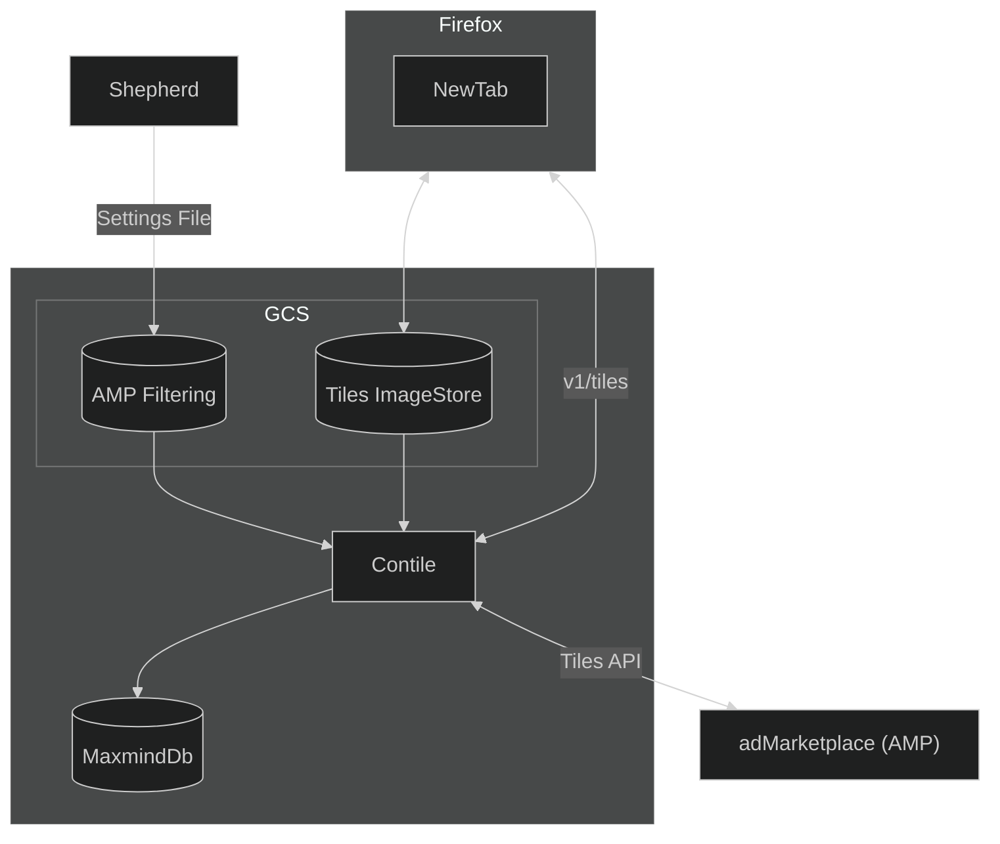

# Contile

Contile is a service that fetches tiles to support the Sponsored Tiles feature in Firefox. Sponsored Tiles are a set of display ads appearing on the Firefox New Tab page provided by either a paying partner, or a selected set of other partners.

## Table of Contents
- [api.md - API Documentation][api_docs]
- [setup.md - Developer Setup Documentation][setup_docs]

[api_docs]: ./api.md
[setup_docs]: ./setup.md

## Architecture

